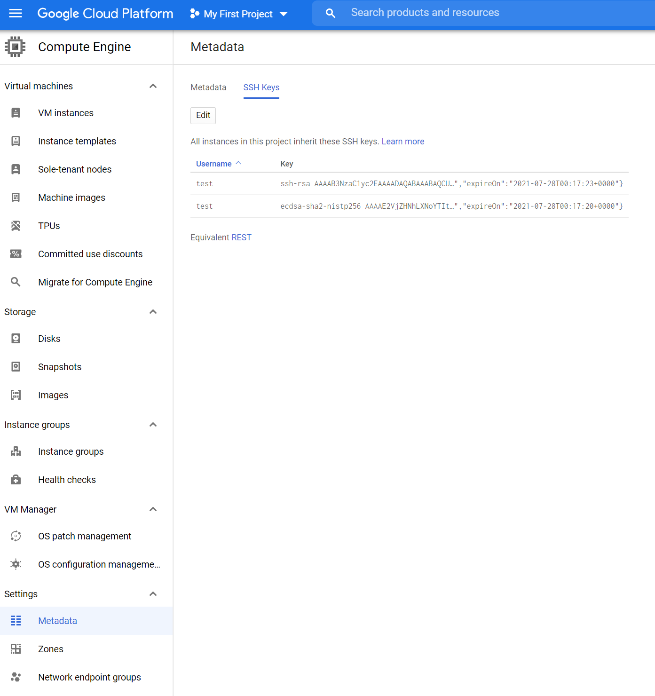

[](https://gitpod.io/#https://github.com/rdwinter2/dev)

# dev
Development system with KinD. Can create a Google Compute Engine VM with the $300 free trial up to 8vCPU/32GB RAM as a custom spec.

```
curl -LsSf https://raw.githubusercontent.com/rdwinter2/dev/main/setup.sh | bash
```

## Table of Contents
<!--ts-->
   * [dev](#dev)
      * [Table of Contents](#table-of-contents)
      * [Instructions](#instructions)
      * [Setup](#setup)
      * [Binaries](#binaries)
      * [Docker images](#docker-images)
      * [On Windows](#on-windows)
      * [SSH Config](#ssh-config)
      * [Set GitLab root password](#set-gitlab-root-password)
      * [gcloud CLI](#gcloud-cli)
      * [Istio JWT](#istio-jwt)
   * [Create the traefik network](#create-the-traefik-network)
   * [docker network create traefik](#docker-network-create-traefik)
   * [Alternatively, you can specify the gateway and subnet to use](#alternatively-you-can-specify-the-gateway-and-subnet-to-use)
   * [docker network create --gateway 192.168.90.1 --subnet 192.168.90.0/24 traefik](#docker-network-create---gateway-192168901---subnet-19216890024-traefik)

<!-- Added by: rdwinter2, at: Fri Apr 23 08:00:51 CDT 2021 -->

<!--te-->

## Instructions

0. Prerequisites to be done in WSL2
1. Clone this repo.
2. Open your WSL terminal and create a rsa ssh key.
3. Add the public rsa ssh key to Google Cloud Platform (GCP).
4. Install gcloud in WSL and run `gcloud init`.
5. Go to the GCP GUI and go though the steps to create a VM. Capture the gcloud command and save it at secrets/gcloud.sh.
6. 


## Prerequisites to be done in WSL2

### Install a Debian or Ubuntu distro as a WSL2 environment

Setup zsh

```bash
sudo apt-get install -yqq zsh
sudo sh -c "$(curl -fsSL https://raw.githubusercontent.com/ohmyzsh/ohmyzsh/master/tools/install.sh)"
```

Configure your default setting for your VSCode terminal to be zsh.

```bash
sudo apt-get install -yqq zsh
sh -c "$(curl -fsSL https://raw.githubusercontent.com/ohmyzsh/ohmyzsh/master/tools/install.sh)"
sudo apt-get install -yqq git 
git config --global user.email "rdwinter2@gmail.com"
git config --global user.name "Robert D. Winter, 2nd"
git config --global core.autocrlf input
git config --global push.default simple
git config --global credential.helper 'cache --timeout 99999999'
git config --global rebase.autosquash true
git config --global init.defaultBranch main
git config --global fetch.prune true
git clone git@github.com:rdwinter2/dev.git
cd dev
scripts/wsl2.sh
```

Restart your terminal.


## Install gcloud in WSL

```bash
sudo apt-get install apt-transport-https ca-certificates gnupg
echo "deb [signed-by=/usr/share/keyrings/cloud.google.gpg] https://packages.cloud.google.com/apt cloud-sdk main" | sudo tee -a /etc/apt/sources.list.d/google-cloud-sdk.list
curl https://packages.cloud.google.com/apt/doc/apt-key.gpg | sudo apt-key --keyring /usr/share/keyrings/cloud.google.gpg add -
sudo apt-get update -yqq && sudo apt-get install -yqq google-cloud-sdk
```

## Create Github and Gitlab tokens

ansible-vault create ~/.ansible/.logins/github_dev_token

ansible-vault create ~/.ansible/.logins/gitlab_flux_token


```bash
#####################
logfile=init_$(date --iso-8601=seconds).log
echo "Logging to logs/${logfile}"
./init.sh | tee logs/${logfile}
#####################

#########################  After configuring OpnSense
/mnt/c/Windows/System32/WindowsPowerShell/v1.0/powershell.exe -File "scripts/flushdns.ps1"
#########################

##############################

gcloud compute instances describe instance-1

ssh instance-1


docker exec -it nexus bash -c "cat /nexus-data/admin.password; echo"

#####################
yes | gcloud compute instances delete instance-1 --zone=us-central1-a --delete-disks=all

# put in a kill switch
x=$(sleep 600; yes | gcloud compute instances delete instance-1 --zone=us-central1-a --delete-disks=all)&
#####################
```

## Setup

Create an offline X.509 Certificate Authority on Windows Subsystem for Linux (WSL). 

```
scripts/generateCerts.sh
```

You can view your certificates with 

```
step_tag=0.17.1
docker run -it --rm --user=$(id -u):$(id -g) -v $HOME/.certs:/home/step smallstep/step-cli:${step_tag} bash -c " \
step certificate inspect root_ca.crt"
```

Convert the X.509 client certificate into a PFX and import it into Windows.

```


[[ -f clientCert_passwd ]] || \
echo $(cat /dev/urandom | tr -dc 'a-zA-Z0-9' | fold -w 32 | head -n 1) > client_crt_password
docker run -it --rm -v $PWD:/home/step smallstep/step-cli:0.16.1 bash -c " \
step certificate p12 client_crt.p12 \
    client_crt.crt client_crt.key \
    --ca=root_ca.crt \
    --password-file=clientCert_password \
"
```

Load `root_ca.crt`, `intermediate_ca.crt`, and `client.p12` into the browser's trust store.

\\wsl$\Ubuntu\home\rdwinter2\.certs\root_ca.crt

\\wsl$\Ubuntu\home\rdwinter2\.certs\intermediate_ca.crt

\\wsl$\Ubuntu\home\rdwinter2\.certs\client.p12

\\wsl$\Ubuntu\home\rdwinter2\.certs\client_passwd

After creating a VM and running the setup.sh script, load the `root_ca.crt` and `intermediate_ca.crt` in the VM's trust store.

In WSL generate commands to execute on the VM. The file produced is stored in `secrets/certs.sh`.

```
scripts/get_certs.sh | tee secrets/certs.sh
```


```
############## EXECUTE ON WSL ###################
cat <<-EOF
############## EXECUTE ON VM ####################
cd ~/dev
cat <<-EOT > secrets/password
$(cat ~/.certs/intermediateCA_password)
EOT
cat <<-EOT > secrets/intermediate_ca.key
$(cat ~/.certs/intermediate_ca.key)
EOT
cat <<-EOT > certs/root_ca.crt
$(cat ~/.certs/root_ca.crt)
EOT
cat <<-EOT > certs/intermediate_ca.crt
$(cat ~/.certs/intermediate_ca.crt)
EOT
sudo cp certs/root_ca.crt /usr/local/share/ca-certificates/root_ca.crt
sudo cp certs/intermediate_ca.crt /usr/local/share/ca-certificates/intermediate_ca.crt
sudo /usr/sbin/update-ca-certificates
############## EXECUTE ON VM ####################
EOF
############## EXECUTE ON WSL ###################
```

In the home router "pfSense" set the Custom Options of the DNS Resolver to the IP of the GCP VM.

```
server:
local-zone: "example.web" redirect
local-data: "example.web 86400 IN A 192.168.1.54"
```

```
sudo apt install -y expect
wget https://github.com/smallstep/cli/releases/download/v0.15.3/step-cli_0.15.3_amd64.deb
sudo dpkg -i step-cli_0.15.3_amd64.deb


# [[ -f pwd_file ]] || echo $(cat /dev/urandom | tr -dc 'a-zA-Z0-9' | fold -w 32 | head -n 1) > pwd_file
docker run -it --rm -v $PWD:/home/step smallstep/step-cli:0.16.0-rc.8 bash -c " \
step certificate create 'Offline Root CA' root_ca.crt root_ca.key --profile=root-ca \
step certificate create 'Example Intermediate CA 1' \
    intermediate_ca.crt intermediate_ca.key \
    --profile=intermediate-ca --ca ./root_ca.crt \
    --ca-key <(step crypto key format --no-password --insecure --pem \
               --password-file <(cat pwd_file) ./root_ca.key) \
    --no-password --insecure \
step certificate create $(hostname) \
    $(hostname).crt $(hostname).key \
    --profile=leaf --ca ./root_ca.crt --ca-key ./root_ca.key \
    --no-password --insecure --not-after 2160h \
"
#  convert the X.509 into a PFX and import it into Windows
openssl pkcs12 -export -out cert.pfx -inkey private.key -in cert.crt -certfile CACert.crt

step certificate create $(hostname) $(hostname).crt $(hostname).key --profile=leaf --ca ./root_ca.crt --ca-key ./root_ca.key --ca-password-file pwd_file --password-file pwd_file2
step certificate create foo foo.crt foo.key --profile=leaf --ca ./root_ca.crt --ca-key ./root_ca.key --ca-password-file pwd_file --password-file pwd_file2

step certificate create opnsense opnsense.crt opnsense.key --profile=leaf --ca ./root_ca.crt --ca-key <(step crypto key format --no-password --insecure --pem --password-file <(cat rootCA_password) ./root_ca.key)     --no-password --insecure --not-after 2160h --san x.x.x.x --san opnsense.example.web
```

Create a VM on Google Compute Engine, or elsewhere. Choose *Debian GNU/Linux 10 (buster)* and *Allow HTTPS traffic*. You uan create a Google Compute Engine VM with upto the $300 free trial up to 24vCPU/128GB RAM as a custom spec.

In WSL, generate a RSA SSH key.

```bash
[[ -f ~/.ssh/id_rsa ]] || ssh-keygen -o -a 100 -t rsa -f ~/.ssh/id_rsa -N "" -C "$(whoami)@$(hostname)"
```

From Windows Powershell copy the keys to a Windows folder.

```powershell
cp \\wsl$\Ubuntu\home\<user>\.ssh\id_rsa* C:\Users\<user>\.ssh
```

Add your public ssh key, `~/.ssh/id_rsa.pub`, to Compute Engine -> Metadata -> SSH Keys. 



Then configure VS Code *Remote-SSH*. Set the `.ssh/config` similar to"

```
Host <VM name>
    HostName <VM External IP>
    Port 22
    User <Username from ssh key>
    IdentityFile <path to>\.ssh\id_rsa
    UserKnownHostsFile=NUL
    CheckHostIP=no
    StrictHostKeyChecking=no
```

Then *Remote-SSH: Connect to Host...*. Install extnsions *Resource Monitor*, 

```bash
curl -LsSf https://gist.githubusercontent.com/rdwinter2/68809acd5e35f42c9319dddd316ff054/raw/d1d2da72f4924482bbbd0fb5d25bf4fcc7cdf246/debian_kind.sh | bash
newgrp docker
```

## Binaries

```
nifi
```

## Docker images

```
alpine/git:v2.30.2
apache/nifi:1.14.0
bitnami/openldap:2.4.59
bitnami/zookeeper:3.7.0
coredns/coredns:1.8.4
gitlab/gitlab-ce:14.1.3-ce.0
gitlab/gitlab-runner:v14.1.0
jboss/keycloak:15.0.2
library/caddy:2.4.3
library/mongo:5.0.2
library/postgres:13.4
library/redis:6.2.5
library/traefik:v2.5.1
linuxserver/code-server:version-v3.11.1
mattermost/mattermost-team-edition:release-5.38
prom/prometheus:v2.29.1
smallstep/step-ca:0.16.2
smallstep/step-cli:0.16.1
sonatype/nexus3:3.33.1
thomseddon/traefik-forward-auth:2.2.0

gcr.io/google-containers/cadvisor:v0.36.0
```

```
curl -vikL --resolve instance-1.example.web:443:35.188.31.180 https://instance-1.example.web/

docker run -it --rm --network=traefik busybox
docker run -it --rm --network=traefik --dns=192.168.90.252 -v /etc/ssl/certs:/etc/ssl/certs:ro smallstep/step-cli
step certificate inspect https://traefik.example.web
step certificate inspect https://nexus.example.web


docker exec -it nexus sh -c "cat /nexus-data/admin.password;echo"

```

## On Windows 

Create a ssh key \

```
ssh-keygen -t ed25519
```

If the External IP of the GCP VM changes:

1. Open PowerShell as an administrator and run `ipconfig /flushdns`.
2. Modify the wildcard DNS in OpnSense
3. Update the .ssh config file for VSCode.

## SSH Config 

On Windows

```
Host instance-1
    HostName <external_IP>
    Port 22
    User <username>
    IdentityFile C:\Users\<username>\.ssh\id_rsa
    UserKnownHostsFile=NUL
    CheckHostIP=no
    StrictHostKeyChecking=no
```

 On WSL


```
Host instance-1
    HostName <external_IP>
    Port 22
    User <username>
    IdentityFile /c/Users/<username>/.ssh/id_rsa
    UserKnownHostsFile=NUL
    CheckHostIP=no
    StrictHostKeyChecking=no
```

## Set GitLab root password

```bash
docker exec -i --tty=false gitlab sh <<-EOF 
gitlab-rails console -e production <<- EOT
user = User.where(id: 1).first
user.password = 'my_secret_pass'
user.password_confirmation = 'my_secret_pass'
user.save!
EOT
EOF
docker exec -it gitlab sh
gitlab-rails console -e production
user = User.where(id: 1).first
user.password = 'secret_pass'
user.password_confirmation = 'secret_pass'
user.save!
exit
exit
```

## gcloud CLI

```bash
gcloud auth login --no-launch-browser
gcloud config set project PROJECT_ID
gcloud compute disk-types list --filter="zone:( us-central1-a us-central1-b us-central1-c us-central1-f )"
gcloud compute zones describe us-central1-a --format="value(availableCpuPlatforms)"


# see file secrets/gcloud.sh for detailed command generated from GCP console
gcloud compute instances create instance-1 \
  --image-family debian-10 \
  --image-project debian-cloud \
  --boot-disk-type=pd-ssd \
  --boot-disk-size=256GB \
  --preemptible

if (-NOT ([Security.Principal.WindowsPrincipal][Security.Principal.WindowsIdentity]::GetCurrent()).IsInRole([Security.Principal.WindowsBuiltInRole] "Administrator"))  
{  
  $arguments = "& '" +$myinvocation.mycommand.definition + "'"
  Start-Process powershell -Verb runAs -ArgumentList $arguments
  Break
}

docker run --rm httpd:2.4-alpine htpasswd -nbB admin "password" | cut -d ":" -f 2 | sed 's/\$/$$/g'

kns() { 
    namespace=$1
    kubectl config set-context --current --namespace=$1
}

```


## Istio JWT

curl host.domain -H "host: f.q.d.n"

https://www.youtube.com/watch?v=MoCFt2zaaVA

---
apiVersion: networking.istio.io/v1alpha3
kind: DestinationRule
metadata:
  name: "enable-mtls"
  namespace: "default"
spec:
  host: "*.local"
  trafficPolicy:
    tls:
      mode: ISTIO_MUTUAL

---
apiVersion: "authentication.istio.io/v1alpha1"
kind: "Policy"
metadata:
  name: "jwt-example"
spec:
  targets:
  - name: hello
  peer:
  - mtls: {}
  origins:
  - jwt:
      issuer: "http-echo@http-echo.kubernetes.newtech.academy"
      jwsUri: "http://auth.kubernetes.newtech.academy/.well-known/jwks.json"
  principalBinding: USE_ORIGIN

---


curl url -H "host: f.q.d.n" -H "Authorization: Bearer $TOKEN"

###

.env.sample
WHOAMI_TAG=v1.5.0
WHOAMI_DIGEST=e6d0a6d995c167bd339fa8b9bb2f585acd9a6e505a6b3fb6afb5fcbd52bbefb8
HOST_NAME=localhost
DOMAINNAME=localdomain
REGISTRY=registry-1.docker.io

docker-compose.yml
version: "3.7"

########################### NETWORKS
# Create the traefik network
# docker network create traefik
# Alternatively, you can specify the gateway and subnet to use
# docker network create --gateway 192.168.90.1 --subnet 192.168.90.0/24 traefik

networks:
  traefik:
    external:
      name: traefik

########################### SERVICES
services:

  whoami:
    container_name: whoami
    hostname: whoami
    domainname: ${DOMAINNAME}
    image: ${REGISTRY}/containous/whoami:${WHOAMI_TAG}@sha256:${WHOAMI_DIGEST}
    restart: always
    networks:
      - traefik
    labels:
      traefik.enable: true
      traefik.http.routers.whoami.rule: Host(`${HOST_NAME}.${DOMAINNAME}`) && PathPrefix(`/whoami`) 
      traefik.http.routers.whoami.service: whoami
      traefik.http.routers.whoami.entrypoints: https
      traefik.http.routers.whoami.middlewares: whoami
      traefik.http.middlewares.whoami.stripPrefix.prefixes: /whoami
      traefik.http.routers.whoami.tls: true
      traefik.http.routers.whoami.tls.certResolver: step
      traefik.http.services.whoami.loadbalancer.server.port: 80


## Prometheus Node Exporter

Export metrics from Linux node, VM or WSL2.

```bash
VERSION=$(curl -fsSL "https://api.github.com/repos/prometheus/node_exporter/releases/latest" | grep '"tag_name"' | sed -E 's/.*"([^"]+)".*/\1/' | cut -c2-)
curl -fsSL -O https://github.com/prometheus/node_exporter/releases/download/v${VERSION}/node_exporter-${VERSION}.linux-amd64.tar.gz
tar xvf ./node_exporter-${VERSION}.linux-amd64.tar.gz
# sudo install --mode=755 --owner=root ./gh_${VERSION}_linux_amd64/bin/gh /usr/local/bin/
# sudo cp -r ./gh_${VERSION}_linux_amd64/share/man/man1/* /usr/share/man/man1/
# rm -rf ./gh_${VERSION}_linux_amd64*

```